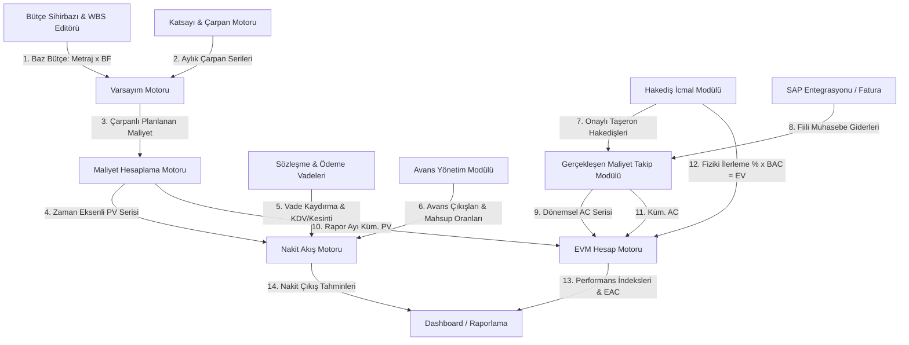

# MODULE_RELATIONSHIPS

Bu belgede Folkart Bütçe ve Maliyet Yönetim Platformu Phase 2'de yer alan modüllerin birbirleriyle olan ilişkileri, veri alışverişleri ve sistemin uçtan uca veri akış şeması tanımlanmıştır.

---

## 1. Veri Akışı ve Modül İlişkileri Şeması

Aşağıdaki akış şeması, bütçenin ilk oluşturulma anından dashboard ekranına kadar verinin hangi modüllerden geçerek işlendiğini göstermektedir:

---

## 2. Modüller Arası İletişim Detayları

### 1. Bütçe Sihirbazı / WBS Editörü ➔ Varsayım Motoru
*   **İletişim**: Bütçe oluşturulduğunda her bütçe satırı baz tutarı (`Baz = Metraj * Birim Fiyat`) ve baz para birimi Varsayım Motoruna iletilir.
*   **Taşınan Veri**: WBS kodu, baz tutar, baz para birimi.

### 2. Katsayı & Çarpan Motoru ➔ Varsayım Motoru
*   **İletişim**: Proje bazlı aylık enflasyon, kur, emtia katsayısı serileri Varsayım Motoruna beslenir.
*   **Taşınan Veri**: Ay bazında kümülatif kur, enflasyon ve endeks çarpan oranları.

### 3. Varsayım Motoru ➔ Maliyet Hesaplama Motoru
*   **İletişim**: Bütçe satırında seçilen çarpanlar (Örn: Kur + Enflasyon) baz tutara uygulanarak ay bazlı bütçe maliyetleri hesaplanır.
*   **Taşınan Veri**: Ay bazında hesaplanmış planlanan maliyet tutarları.

### 4. Maliyet Hesaplama Motoru ➔ Nakit Akış Motoru
*   **İletişim**: Bütçelenen maliyetlerin ödeme planına dönüştürülmesi için zaman eksenli planlanan maliyet serisi iletilir.
*   **Taşınan Veri**: Ay bazında planlanan maliyet tutarları.

### 5. Sözleşme & Ödeme Vadeleri ➔ Nakit Akış Motoru
*   **İletişim**: Her bütçe satırına ait ödeme vadesi (ay sayısı) ve KDV/Kesinti kuralları nakit akışı hesaplamasında maliyet aylarını ötelemek için kullanılır.
*   **Taşınan Veri**: Vade öteleme ay sayısı, KDV oranı, teminat ve vergi kesinti oranları.

### 6. Avans Yönetim Modülü ➔ Nakit Akış Motoru
*   **İletişim**: Yapılan avans ödemeleri nakit çıkışına doğrudan eklenir. Hakediş ödemelerinden yapılacak mahsuplar ise nakit çıkışını azaltıcı etken olarak hesaba katılır.
*   **Taşınan Veri**: Avans çıkış ayı ve tutarı, hakediş avans mahsup tutarları.

### 7. Hakediş İcmal Modülü & SAP Entegrasyonu ➔ Gerçekleşen Maliyet (AC) Takip Modülü
*   **İletişim**: Taşeron hakedişleri ve fatura gerçekleşmeleri birleştirilerek WBS kalemlerine gerçekleşen maliyet (`AC`) olarak yansıtılır.
*   **Taşınan Veri**: WBS kodu bazında dönemsel fiili harcama tutarları.

### 8. Maliyet Hesaplama, Hakediş ve Gerçekleşen Takip Modülleri ➔ EVM Hesap Motoru
*   **İletişim**: Raporlama ayı itibarıyla kümülatif `PV` (Planlanan), `AC` (Gerçekleşen) ve `EV` (Kazanılmış Değer) toplamları EVM Motoruna gönderilir.
*   **Taşınan Veri**: Kümülatif PV, AC, EV ve baz bütçe BAC tutarları.

### 9. EVM Hesap Motoru & Nakit Akış Motoru ➔ Dashboard / Raporlama
*   **İletişim**: EVM performans metrikleri (CPI, SPI, EAC, VAC) ve Nakit Akış tahminleri dashboard ekranında grafiksel ve tablosal gösterimler için kullanılır.
*   **Taşınan Veri**: CPI, SPI, EAC, VAC, Nakit Akış aylık planlanan ve gerçekleşen serileri.
