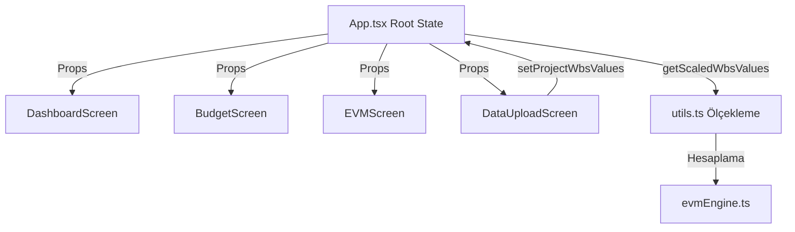

# SYSTEM_ARCHITECTURE

## 1. Proje Klasör Yapısı

Phase 2 itibarıyla projenin temel dizin yapısı aşağıdaki şekildedir:

*   **Proje Ana Dizini (Root)**: Yapılandırma dosyalarını (`package.json`, `vite.config.ts`, `tsconfig.json` vb.), anayasa belgesini (`AGENTS.md`), faz vizyonunu (`PRODUCT_VISION_PHASE_2.md`) ve analiz belgelerini barındırır.
*   **`src/`**: Tüm uygulama kodlarının bulunduğu ana dizindir.
    *   **`src/app/`**: Uygulamanın çekirdek dosyalarını ve ekranlarını içerir.
        *   `App.tsx`: Tüm ana ekran geçişlerinin, sidebar düzeninin, genel state'lerin ve modal pencerelerin yönetildiği ~3368 satırlık monolitik ana bileşendir.
        *   `evmEngine.ts`: Kazanılmış Değer Analizi (EVM) hesaplama mantığını barındıran merkezi motor.
        *   `mockData.ts`: Portföy verileri, başlangıç bütçeleri, statik grafik verileri, kullanıcı listeleri, terimler rehberi ve WBS hiyerarşisini barındıran veri dosyası.
        *   `types.ts`: Ekran, Proje, Bütçe Versiyonu, WBS Değeri gibi tüm TypeScript arayüzlerini ve veri modellerini barındırır.
        *   `utils.ts`: Sayı biçimlendirme, Excel dışa aktarma, tarih ayrıştırma, rapor dönemi ölçeklendirme ve WBS veri üreteci yardımcı fonksiyonları.
    *   **`src/app/components/`**: Yeniden kullanılabilir UI bileşenleri.
        *   `shared.tsx`: Projenin açık temasına uygun buton (`Btn`), etiket (`Chip`), ilerleme çubuğu (`ProgressBar`), gösterge (`CpiGauge`), metrik kartı (`MetricCard`) ve kart yapıları (`Card`, `CardHeader`, `PageHeader`, `ChartTooltipContent`) gibi ortak bileşenler.
        *   `figma/`: `ImageWithFallback.tsx` gibi Figma entegrasyonu görsel yedeklerini yöneten bileşen.
        *   `ui/`: Gelecekteki modüler yapılar için hazır durumda bekleyen Radix UI / Shadcn uyumlu bileşen kütüphanesi (Accordion, Dialog, Select, Table vb. - şu an ana ekranlar bunları doğrudan kullanmamaktadır).
    *   **`src/app/screens/`**: Ana dosyadan ayrıştırılmış bazı ekran bileşenleri.
        *   `HakedisScreen.tsx`: Hakediş yönetimi, özet kartları ve hakediş listesi tablosu.
        *   `ResourceListScreen.tsx`: Ana PYP -> Alt PYP -> Kaynak Kodu hiyerarşisini gösteren kaynak listesi ve Excel şablon yönetimi.
        *   `UsersScreen.tsx`: Sistem kullanıcıları listesi ve rol/durum yönetimi.
        *   `GlossaryScreen.tsx`: Terimler rehberi, EVM formülleri ve yorumlama kılavuzu.
    *   **`src/styles/`**: Stil yapılandırması.
        *   `theme.css`: Folkart Light Theme (açık renk tema) renk paleti değişkenlerini barındıran CSS dosyası (koyu tema tamamen devre dışıdır).
        *   `index.css`: Genel CSS giriş noktası.
        *   `tailwind.css`: Tailwind v4 direktifleri.
*   **`dist/`**: Vite derleme çıktısı (SPA ve Firebase deploy uyumlu statik dosyalar).
*   **`docs/`**: Yol haritası ve faz belgeleri.
*   **`versions/`**: Geriye dönük uyumluluk veya yedekleme için önceki stabil `App.tsx` ve `theme.css` sürümlerini barındıran dizin.

---

## 2. Teknoloji Yığını

*   **Çekirdek Kütüphane**: React 18.3.1 (Single Page Application - SPA).
*   **Programlama Dili**: TypeScript (güçlü tip denetimi ve veri yapıları).
*   **Derleyici & Araç Seti**: Vite 6.3.5 ve `@vitejs/plugin-react` eklentisi.
*   **Stil Yönetimi**: Tailwind CSS v4 (`@tailwindcss/vite`) + Standart CSS Değişkenleri (`theme.css`).
*   **Grafikler & Görselleştirme**: Recharts (Alan, Çubuk, Çizgi grafik bileşenleri).
*   **İkon Seti**: Lucide React.
*   **Dosya İşleme**: SheetJS (`xlsx` kütüphanesi) - Excel formatında yükleme ve indirme işlemleri için.

---

## 3. Ana Dosyalar

1.  [`src/main.tsx`](file:///C:/Users/sefika.huseyinbeyli/OneDrive%20-%20Saya%20Holding/Desktop/F%C4%B0GMA%20TASARIM%20GEL%C4%B0%C5%9ET%C4%B0RME%20-%20PHASE%202/src/main.tsx): Uygulamanın DOM üzerine yüklendiği ve `App` bileşeninin çağrıldığı giriş dosyası.
2.  [`src/app/App.tsx`](file:///C:/Users/sefika.huseyinbeyli/OneDrive%20-%20Saya%20Holding/Desktop/F%C4%B0GMA%20TASARIM%20GEL%C4%B0%C5%9ET%C4%B0RME%20-%20PHASE%202/src/app/App.tsx): Uygulamanın kalbi. State yönetimi, sidebar menü düzeni, proje/versiyon/tarih seçim barları ve ekranların render haritası bu dosyada tutulur.
3.  [`src/app/evmEngine.ts`](file:///C:/Users/sefika.huseyinbeyli/OneDrive%20-%20Saya%20Holding/Desktop/F%C4%B0GMA%20TASARIM%20GEL%C4%B0%C5%9ET%C4%B0RME%20-%20PHASE%202/src/app/evmEngine.ts): PMBOK uyumlu CPI, SPI, CV, SV, EAC vb. formüllerini çalıştıran merkezi hesaplama motoru.
4.  [`src/app/utils.ts`](file:///C:/Users/sefika.huseyinbeyli/OneDrive%20-%20Saya%20Holding/Desktop/F%C4%B0GMA%20TASARIM%20GEL%C4%B0%C5%9ET%C4%B0RME%20-%20PHASE%202/src/app/utils.ts): Excel import/export işleyicileri, kümülatif bütçe ölçekleme mantığı (`getScaledWbsValues`) ve tarih formatlama fonksiyonları.

---

## 4. Routing / Ekran Geçiş Mantığı

*   Uygulamada URL tabanlı herhangi bir React Router veya benzeri kütüphane kullanılmamaktadır.
*   Ekran geçişleri `App.tsx` içindeki yerel React state'i ile yönetilir:
    ```typescript
    const [screen, setScreen] = useState<Screen>("dashboard");
    ```
*   `screenComponent: Record<Screen, React.ReactNode>` nesnesi, aktif `screen` değerine karşılık gelen ekran bileşenini dinamik olarak ana `<main>` bloğu içine yerleştirir.
*   Sidebar üzerindeki butonlar `setScreen` fonksiyonunu tetikleyerek ekran geçişini sağlar.

---

## 5. State Yönetimi

Uygulamanın genel veri durumu (State) monolitik olarak `App.tsx` dosyasında en üst seviyede tutulur ve alt ekranlara **Props** kanalıyla iletilir:

*   `projects`: Proje künyelerini barındıran dizi.
*   `budgetVersions`: Projelere ait bütçe versiyonlarını barındıran dizi.
*   `projectWbsValues`: Bütçe satırlarının kümülatif BAC, PV, EV, AC değerlerini tutan dizi.
*   `selectedProjIds`: Kullanıcının üst bardan seçtiği projelerin ID'leri (Konsolide görünümleri tetikler).
*   `reportMonth`: Üst bardan seçilen aktif raporlama dönemi (Örn: `"Eyl'24"`).
*   `addProjOpen` / `projDropdownOpen` / `periodChangeConfirm`: Modal pencerelerin ve dropdown menülerin açık/kapalı durumları.

---

## 6. Veri Akışı



1.  **Giriş**: Kullanıcı Excel üzerinden veri yüklediğinde veya bir parametreyi değiştirdiğinde, `App.tsx` üzerindeki root state güncellenir.
2.  **Ölçekleme**: Raporlama dönemi değiştiğinde `getScaledWbsValues` fonksiyonu çağrılarak `projectWbsValues` dizisindeki planlanan ve gerçekleşen değerler, seçilen ayın kümülatif ağırlık katsayısına (`MONTHLY_CF` içindeki katsayılara) göre ölçeklenir.
3.  **KPI Hesaplama**: Ölçeklenmiş değerler, EVM motoruna gönderilerek CV, SV, CPI, SPI ve EAC anlık olarak hesaplanır ve ekrana yansıtılır.

---

## 7. Excel Import Akışı

1.  `DataUploadScreen` ekranında kullanıcı rapor ayını ve yılını seçer.
2.  Excel dosyası seçildiğinde dosya ismi ve dönemi doğrulanır.
3.  `FileReader` vasıtasıyla dosya ikili dizi olarak okunur ve `SheetJS` ile JSON satırlarına dönüştürülür.
4.  `validateExcelFile` ile zorunlu kolonların (`Kaynak Kodu`, `Kaynak Adı`, `Birim`, `Planlanan Miktar`, `Planlanan Birim Fiyat`) varlığı ve sayısal alanlar kontrol edilir.
5.  **Kaydet** butonuna basıldığında, root state'teki `projectWbsValues` güncellenir:
    *   `bac = (Planlanan Miktar * Planlanan Birim Fiyat) / 1,000,000` formülü uygulanarak milyon bazında BAC elde edilir.
    *   Yeni eklenen kalemler için varsayılan EVM değerleri atanır (`pv: bac * 0.5`, `ev: 0`, `ac: 0`, `eac: bac`).

---

## 8. Dashboard Veri Akışı

1.  `DashboardScreen` bileşeni, props ile gelen `projectWbsValues` verisini seçili rapor ayına göre kümülatif olarak ölçekler.
2.  Seçili projelerin verileri filtrelenir ve BAC, PV, AC, EV kümülatif toplamları alınır.
3.  `calculateEVM` fonksiyonu bu toplamları kullanarak genel portföy metriklerini üretir.
4.  Üretilen metrikler 9 adet `MetricCard` bileşenine beslenir.
5.  EVM kümülatif değerleri Recharts `BarChart` bileşeni ile görselleştirilir.

---

## 9. EVM Hesaplama Akışı

Hesaplamalar [`evmEngine.ts`](file:///C:/Users/sefika.huseyinbeyli/OneDrive%20-%20Saya%20Holding/Desktop/F%C4%B0GMA%20TASARIM%20GEL%C4%B0%C5%9ET%C4%B0RME%20-%20PHASE%202/src/app/evmEngine.ts) içindeki `calculateEVM` fonksiyonu üzerinden tek bir noktadan yürütülür:
*   `CV = EV - AC`
*   `CPI = EV / AC` (Bölen sıfır veya tanımsızsa `null` döner)
*   `SV = EV - PV`
*   `SPI = EV / PV` (Bölen sıfır veya tanımsızsa `null` döner)
*   `EAC = BAC / CPI` (CPI tanımsız veya sıfır ise `null` döner)
*   `ETC = EAC - AC`
*   `VAC = BAC - EAC`
*   `TCPI = (BAC - EV) / (BAC - AC)`

---

## 10. Grafiklerin Veri Kaynakları

*   **Bütçe Karşılaştırma Grafiği (Dashboard)**: Dinamik hesaplanan kümülatif `BAC`, `PV`, `AC`, `EV`, `EAC` değerleri kullanılır.
*   **S-Eğrisi (S-Curve)**: `mockData.ts` içindeki `S_CURVE` statik dizisinden beslenir. İthal edilen bütçelerle doğrudan dinamik bir bağı yoktur (Teknik Borç).
*   **Nakit Akışı (Cashflow)**: `mockData.ts` içindeki `MONTHLY_CF` dizisinden ve seçilen projenin bütçe toplamından çarpanlarla üretilen yarı statik bir veri yapısı kullanır.
*   **EVM Performans Trendi (EVM)**: `mockData.ts` içindeki `EVM_TREND` statik dizisini kullanır.

---

## 11. Ortak Bileşenler (Shared Components)

[`shared.tsx`](file:///C:/Users/sefika.huseyinbeyli/OneDrive%20-%20Saya%20Holding/Desktop/F%C4%B0GMA%20TASARIM%20GEL%C4%B0%C5%9ET%C4%B0RME%20-%20PHASE%202/src/app/components/shared.tsx) altında toplanmıştır:
*   `Chip`: Durum göstergeleri için renklendirilmiş rozet.
*   `Btn`: Ortak buton tasarımı (Ghost ve Primary varyasyonları).
*   `ProgressBar`: Fiziki veya bütçesel ilerleme çubukları.
*   `CpiGauge`: CPI ve SPI göstergeleri için SVG dairesel gösterge.
*   `MetricCard`: Trend ikonlu ve sayısal göstergeli KPI kartı.
*   `Card` & `CardHeader`: Panel içi çerçeve bileşenleri.
*   `PageHeader`: Ekran başlığı ve eylem butonları alanı.
*   `ChartTooltipContent`: Recharts grafiklerine özel Folkart açık tema tasarımlı tooltip bileşeni.

---

## 12. Yardımcı Fonksiyonlar

[`utils.ts`](file:///C:/Users/sefika.huseyinbeyli/OneDrive%20-%20Saya%20Holding/Desktop/F%C4%B0GMA%20TASARIM%20GEL%C4%B0%C5%9ET%C4%B0RME%20-%20PHASE%202/src/app/utils.ts) altında toplanmıştır:
*   `fmt`, `fmtM`, `fmtPct`: Sayıları Milyon TL cinsinden veya yüzde olarak formatlar. Bölme hatalarını ve tanımsız değerleri engeller.
*   `cpiColor`: CPI ve SPI değerine göre standart durum rengini döner (Yeşil, Sarı, Kırmızı).
*   `saveAsExcel` & `handleExportExcel`: JSON verisini istemci tarafında indirilebilir Excel formatına dönüştürür.
*   `getScaledWbsValues`: Seçilen rapor ayına göre kümülatif bütçe değerlerini ölçekler.
*   `generateInitialWbsValues`: Proje oluşturulduğunda bütçe versiyonları için başlangıç WBS verilerini hash tabanlı algoritmalarla üretir.

---

## 13. Mevcut Güçlü Yönler

*   **Tutarlı Görsel Kimlik**: Folkart kurumsal açık tema tasarımı tüm bileşen ve tablolarda başarılı bir şekilde uygulanmıştır.
*   **Merkezi Hesaplama**: Finansal ve EVM formülleri tek elden yönetilmekte ve bölen sıfır kontrolü gibi kritik denetimler içermektedir.
*   **Performanslı Çalışma**: İstemci tarafında çalışan SPA yapısı sayesinde sayfa geçişleri ve hesaplamalar son derece hızlıdır.

---

## 14. Teknik Borçlar (Technical Debt)

*   **Monolitik `App.tsx`**: Arayüz stilleri, ekran bileşenleri, modal pencereler ve veri işleyicileri tek bir dosyaya yığılmıştır (~3368 satır).
*   **Grafiklerin Statikliği**: S-Eğrisi ve EVM Trend grafikleri doğrudan Excel'den yüklenen verilerden değil, `mockData.ts` içindeki statik veri setlerinden beslenmektedir.
*   **Veri Kaydetmeme**: Firebase entegrasyonu olmadığı için tarayıcı yenilendiğinde veriler sıfırlanmaktadır (Yalnızca dosya geçmişi `localStorage` üzerinde tutulur).

---

## 15. Phase 2 İçin Mimari Riskler

*   **State Dağılımı**: Ekranları ayrı dosyalara taşırken veya yeni bütçe modülleri eklerken root state'in kontrolsüz büyümesi (Prop Drilling) karmaşıklığa yol açabilir.
*   **Excel Kolon Bağımlılığı**: Excel import mekanizması kolon adlarına birebir bağımlıdır. İleride kolon adlarındaki en ufak bir Türkçe karakter veya yazım farkı tüm import akışını bozabilir.
*   **Kur Dönüşümleri**: Projelerin tek para birimi (`TRY`, `USD`, `EUR`) varsayımı üzerine kurulu olması, karışık para birimi bütçe satırları eklendiğinde mevcut kümülatif toplama mantıklarını geçersiz kılabilir.
